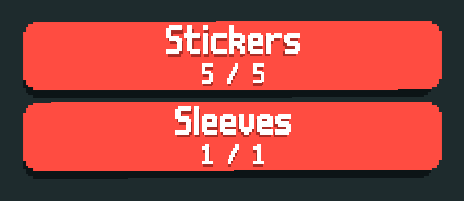

## What is this?

This mod is a counter-balance to Cryptid's madness gameset. It adds 10 difficulty modes, ranging from base Cryptid to impossible and many blinds that can only appear on higher difficulty.

## Additions

* 1 Rarity (Apollyon)

## How to install?

### Cryptid or Cryptlib
This mod requires either [Cryptid](https://github.com/SpectralPack/Cryptid) or [Cryptlib](https://github.com/SpectralPack/Cryptlib)

### Talisman
This mod requires [Talisman](https://github.com/SpectralPack/Talisman)

### The Tower
If you want the latest version of The Tower, [download this](https://github.com/Tarot-Pack/The-Tower/releases/latest) and extract it to your Mods folder. You can refer to Cryptid's videos on how to install Mods on [mac](https://www.youtube.com/watch?v=l5ni7fHgwTE) and [not-mac](https://www.youtube.com/watch?v=aUr0gXE77rk) if you wish.